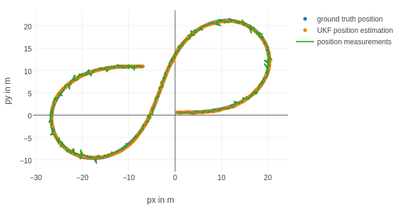
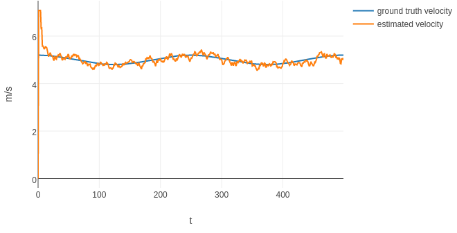
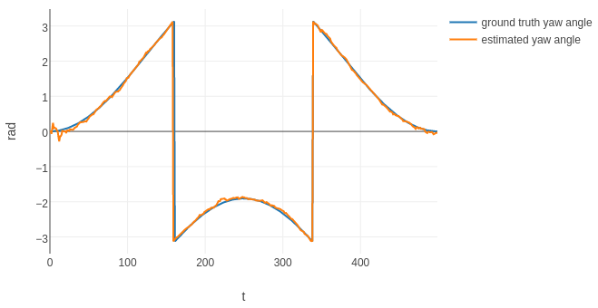
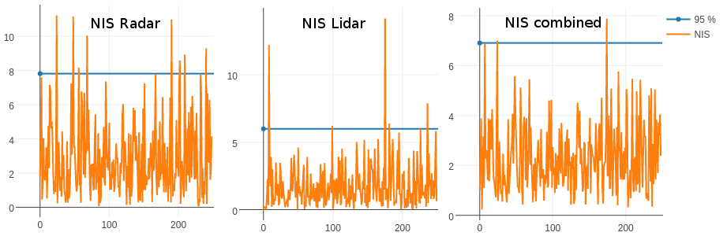

# Unscented Kalman Filter
## Udacity Self-Driving Car Engineer Nanodegree Program

Implementation of an Unscented Kalman Filter using the CTRV motion model.

Sample data for Radar and Lidar input was provided by Mercedes Benz.

## Implementation

Implementation of the EKF is mostly straightforward with emphasis on readability over speed.  

The challenge here was to initialize everything in a reasonable way and tweak the process noise parameters to beat a certain required accuracy threshold.  

I used Normalized Innovation Squared to make sure my filter is consistent. Visualization for all outputs are contained in a separate IPython notebook `ukf-visualization.ipynb`.  

## Results

| RMSE goal | RMSE UKF | RMSE UKF (lidar only) | RMSE UKF (radar only) |
| --- | --- |  --- | --- |
| *0.09*  |  **0.0685** |  0.108 |  0.156 |
|  *0.10*  |  **0.0827** |  0.098 |  0.240 |
|  *0.40*  |  **0.3329** |  0.615 |  0.393 |
|  *0.30*  |  **0.2333** |  0.263 |  0.291 |

### Position accuracy: 

### Velocity accuracy: 

### Yaw accuracy: 

### Normalized Innovation Squared:

---

## Dependencies

* cmake >= v3.5
* make >= v4.1
* gcc/g++ >= v5.4

## Basic Build Instructions

1. Clone this repo.
2. Make a build directory: `mkdir build && cd build`
3. Compile: `cmake .. && make`
4. Run it: `./UnscentedKF path/to/input.txt path/to/output.txt`. You can find
   some sample inputs in 'data/'.
    - eg. `./UnscentedKF ../data/sample-laser-radar-measurement-data-1.txt output.txt`
